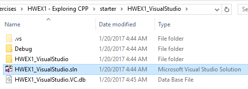

# Homework Exercise 1: Exploring C++

## Downloads

Before you get started, make sure to download a .zip file of the
Visual Studio or Code::Blocks project (based on what you're using
at home or at school).

* [Visual Studio project](https://github.com/Rachels-Courses/CS200-Concepts-of-Progamming-Algorithms/blob/master/Assignments/Homework%20Exercises/HWEX1%20-%20Exploring%20CPP/starter/HWEX1_VisualStudio.zip?raw=true)
* [Code::Blocks project](https://github.com/Rachels-Courses/CS200-Concepts-of-Progamming-Algorithms/blob/master/Assignments/Homework%20Exercises/HWEX1%20-%20Exploring%20CPP/starter/HWEX1_CodeBlocks.zip?raw=true)

Extract the zip file to your hard drive and open the project. You will want to locate and open the **Solution** file (.sln)

## Rules

* Team size: **1 person**
    * You can brainstorm with others - that is, you can verbally discuss the problem.
    * You cannot copy another person's work. 
    Code will be checked against other submissions with a diff tool.
    If a copy is found, both people will receive a 0 on the assignment.
* Open book / open note - do research as-needed.

---

## Part 1: Testing the program

Run the program and make sure that, for the given input, you get the same output,
such as:

    Enter the width: 3
    Enter the length: 4

    Area: 12

If you enter in 3 for the width and 4 for the length, do you get 12 back?

## Part 2: Modifying the program

Add the following modifications to the program, using what is already there for reference.

### A. Add a program title

Change the program so that, when the program is run, a header is displayed
with the program's name. The entire program run should look like this:

    ROOM CALCULATOR
    
    Enter the width: 5
    Enter the length: 5

    Area: 25

*Hint: You will need a cout statement for this.*

### B. Calculate the perimeter

Using the area calculation for reference, modify the program to add
a second calculation - calculating the perimeter of the room.

Declare a new **float** variable called perimeter.
Assign it the value of:

    2 * width + 2 * length;
    
Then, display the result with **cout**. Make sure you label it as **Perimeter:**,
just like how the Area is being labeled.

Sample output:

    ROOM CALCULATOR
    
    Enter the width: 5
    Enter the length: 4

    Area: 20
    Perimeter: 18

### C. Calculate for two rooms

Duplicate the code that is already within main() so that it will ask
the user for the width and length of the room twice, and
calculate the area and perimeter twice.

You will reuse the **cout** and **cin** statements, as well as the
**assignment** statements on the area and perimeter variables.

Make sure to also add two labels with **cout**. At the beginning
of the first set of questions, display that it is for "Room 1",
and at the beginning of the second set of questions, display that it is for "Room 2".

Sample output:

    ROOM CALCULATOR
    
    Room 1
    
    Enter the width: 5
    Enter the length: 5

    Area: 25
    Perimeter: 20
    
    Room 2
    
    Enter the width: 5
    Enter the length: 4

    Area: 20
    Perimeter: 18

## Submit your work

### GitHub

Upload your project to GitHub in your CS200 repository:

Go to your CS200 repository page from the GitHub website. The URL to get to your profile page
should be github.com/YOURUSERNAME.

Click on the **Exercises** folder that you should have created during Lab 1.

Use the [upload files instructions](https://github.com/Rachels-Courses/CS200-Concepts-of-Progamming-Algorithms/blob/master/Assignments/In-class%20Labs/Lab%2001%20-%20Intro%20to%20GitHub%20and%20CPP.md#upload-files)
from Lab 1 to upload your **folder for this exercise** to GitHub.

### D2L

Once you're finished with all the steps, zip up your entire project folder
and upload it to the dropbox in D2L.

In the comments, paste the URL of your CS 200 repository.
