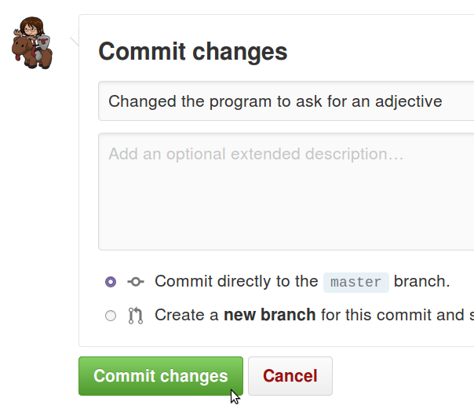
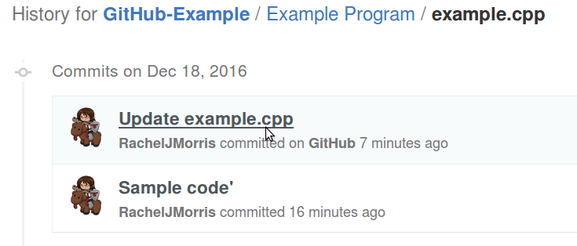

# In-class Lab 1: Intro to GitHub and C++

## Downloads

No downloads

## Rules

* Team size: **1 to 3 people**
    * If you work with a teammate, **make sure to upload your files with both your names.**
* Following along with the steps!

---

## Part 1: Registering a GitHub account

First, you will register an account on GitHub.
Accounts and using the service is free, so long as your code is
available publicly. (It costs to privately host code on GH).

Go to [GitHub.com](https://github.com/) and register your account.

Create a username (this can be anything) and set an email address.
You can change both of these later on.

Make sure to choose the free plan.

Confirm your email address and we should be ready to go!

---

## Part 2: Fork an existing repository

To "fork" a repository means to create a copy of someone else's repo.

You can make changes to your own fork without affecting the original,
though if you make some changes to improve the origin version,
later on you can create a *pull request* to request that your code
is made part of the original project.

Otherwise, it could be useful to fork someone else's code to make it
your own.

Go to the sample repository here:

[https://github.com/Rachels-Courses/GitHub-Example](https://github.com/Rachels-Courses/GitHub-Example)

Click on the **Fork** button in the upper-right corner. 

After some loading...

...a clone will be made on your own profile.

### Explore the repository

You can view files in the repository from the web interface. Click on the
**Example Program** folder, and you will see an **example.cpp** file within.

If you click on this file, it will open up:

### Download the repository

Back on the front page of your version of the repository (click on the repository name in the header)...

...click on the **Clone or download** button, which is green:

Click on **Download ZIP**, and it will download all the files from the
repository as a zip file.

Extract the zip file on your hard drive and navigate into the **Example Program**
folder on your machine.

Open up the project folder (either the .cbp for Code::Blocks, or .sln Solution for Visual Studio).

---

## Part 3: Making changes

Once the project is downloaded, **Build and Run** the program.

It will ask for your name and favorite color, and respond with a question:

Using the code that's already written, make the following changes:

1. Change the text output to be all CAPITAL LETTERS.
2. Change the **name** variable to be called **firstName** instead. Update all locations that use **name**.
3. Using the current Variable declarations for reference, create another new string variable named **adjective**.
4. Using the current Output and input for reference, have the program output the message, "ENTER AN ADJECTIVE: "
5. Using the current Output and input for reference, have the program get the user's input and store it in your **adjective** variable.
6. Using the current "So can I call you" output for reference, change it so that it will suggest ADJECTIVE + COLOR + NAME as the name to call the user.

---

## Part 4: Updating GitHub

Normally, you would interface with GitHub through a program called **Git**, which makes
uploading your changes pretty easy.

For now, we're just going to work through the web interface.

In your repository, open up **Example Program / example.cpp** again. Notice that there's
several buttons on the top of the file: Raw, Blame, History, a pencil, and a garbage can.

Click on the pencil to edit the file.

In the web interface, it will turn into a text editor.

From Visual Studio or Code::Blocks, select all of your code (CTRL+A) and copy (CTRL+C).

Back in the GitHub interface, select all (CTRL+A), and replace it all with your copied code (CTRL+V).

At the bottom of the page, there is a spot to enter notes about what you've changed.

Enter in a simple comment about what you added, then click on **Commit changes.**

Now, the web interface will show your new version.

---

## Part 5: Exploring history

If you click on **History**, you will see a list of all changes to your file.
The messages displayed here are the same as the commit message you made when
updating the file.

If you click on one of these commits, it will give you a breakdown of
the lines of code that changed:

Red lines means they were removed (or altered), and the green lines
mean that they were added to the file.

Using this, if you commit often you can see your changes over time.

---

## Submit your work

Once you're finished with all the steps, zip up your entire project folder and upload it to the dropbox in D2L.

In the **comments** field, paste in the **URL of your repository**.
