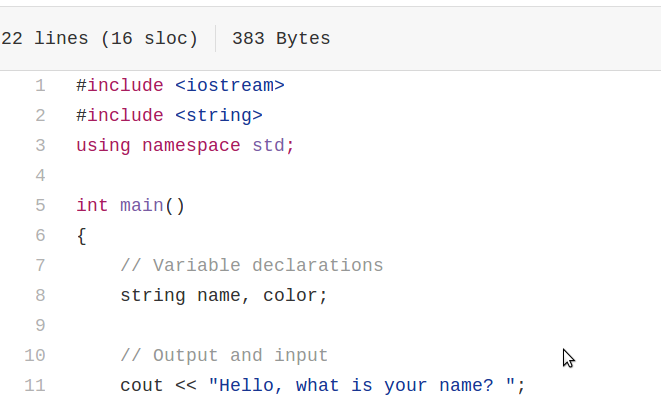
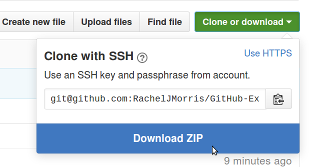
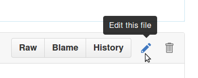
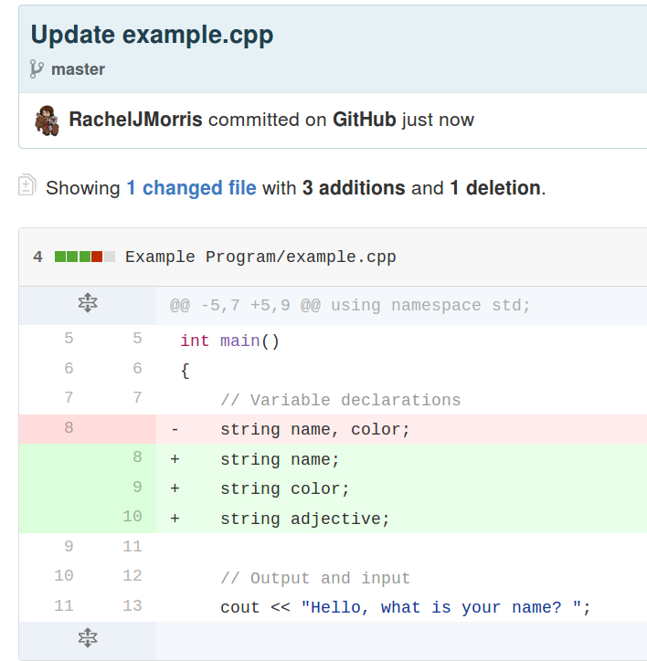
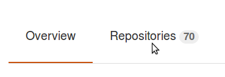
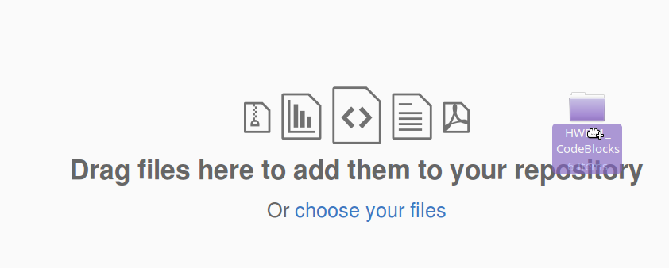
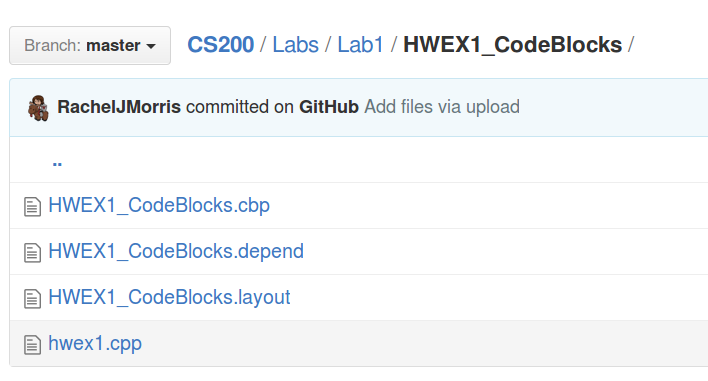

# In-class Lab 1: Intro to GitHub and C++

## Downloads

No downloads

## Rules

* Team size: **1 person**
    * This is a simple lab, and everybody needs a GitHub account,
    so work on these separately.
* Following along with the steps!

---

## Project 1: Creating a GitHub account

First, you will register an account on GitHub.
Accounts and using the service is free, so long as your code is
available publicly. (It costs to privately host code on GH).

Go to [GitHub.com](https://github.com/) and register your account.

Create a username (this can be anything) and set an email address.
You can change both of these later on.

Make sure to choose the free plan.

Confirm your email address and we should be ready to go!

---

## Project 2: Fork an existing repository

### Fork an existing repository

To "fork" a repository means to create a copy of someone else's repo.

You can make changes to your own fork without affecting the original,
though if you make some changes to improve the origin version,
later on you can create a *pull request* to request that your code
is made part of the original project.

Otherwise, it could be useful to fork someone else's code to make it
your own.

Go to the sample repository here:

[https://github.com/Rachels-Courses/GitHub-Example](https://github.com/Rachels-Courses/GitHub-Example)

Click on the **Fork** button in the upper-right corner. 

After some loading...

...a clone will be made on your own profile.

### Explore the repository

You can view files in the repository from the web interface. Click on the
**Example Program** folder, and you will see an **example.cpp** file within.

If you click on this file, it will open up:

### Download the repository

Back on the front page of your version of the repository (click on the repository name in the header)...

...click on the **Clone or download** button, which is green:

Click on **Download ZIP**, and it will download all the files from the
repository as a zip file.

Extract the zip file on your hard drive and navigate into the **Example Program**
folder on your machine.

Open up the project folder (either the .cbp for Code::Blocks, or .sln Solution for Visual Studio).

---

### Making changes

Open up the

   Example Program/example.cpp
   
file and make some changes - they don't have to be changes that will run or compile, we're just doing some basics.

Make some changes and save the file, then continue on.

---

### Updating GitHub

Normally, you would interface with GitHub through a program called **Git**, which makes
uploading your changes pretty easy.

For now, we're just going to work through the web interface.

In your repository, open up **Example Program / example.cpp** again. Notice that there's
several buttons on the top of the file: Raw, Blame, History, a pencil, and a garbage can.

Click on the pencil to edit the file.

In the web interface, it will turn into a text editor.

From Visual Studio or Code::Blocks, select all of your code (CTRL+A) and copy (CTRL+C).

Back in the GitHub interface, select all (CTRL+A), and replace it all with your copied code (CTRL+V).

At the bottom of the page, there is a spot to enter notes about what you've changed.

Enter in a simple comment about what you added, then click on **Commit changes.**

Now, the web interface will show your new version.

---

### Exploring history

If you click on **History**, you will see a list of all changes to your file.
The messages displayed here are the same as the commit message you made when
updating the file.

If you click on one of these commits, it will give you a breakdown of
the lines of code that changed:

Red lines means they were removed (or altered), and the green lines
mean that they were added to the file.

Using this, if you commit often you can see your changes over time.

---

### Submit your work

Once you're finished with all the steps, zip up your entire project folder and upload it to the dropbox in D2L.

In the **comments** field, paste in the **URL of your repository**.

--- 

## Project 3: Create a repository for class

Now you will create an original repository in your own profile. You will use this repository
to store your class projects during the semester.

Go to your profile page on GitHub. It will be something like github.com/YOURUSERNAME.

Click on the **Repositories** tab.

Then, click on the green **New** button.

### Creating the repository

**MAKE SURE YOU SELECT INITIALIZE WITH README BEFORE CREATING THE REPOSITORY!**

Set up the following information in the repository:

1. **Repository name** - CS200 or something similar
2. **Description** - Optional
3. **Public**
4. **Initialize this repository with a README**

After you're done, click **Create repository**.

It will open the repo, and it will just have one file in it.

### Adding folders and files

Normally, we would use the **Git** program on our desktop to work with our repository
on our local machine. However, we're keeping it simple at first, so we are just using 
the web interface.

Creating folders within the repository is kind of a "hidden feature",
but it is good to utilize folders to keep everything separate and organized.

Let's go ahead and create a folder for your CS 200 labs.

Click on **Create new file**.

In the **Name your file...** textbox, you can enter a file name -
but you can also specify a folder before your filename.

Type in

    Labs/Readme.txt
    
When you hit the slash button / , it will automatically turn **Labs** into a folder.

The readme we're creating really is just a placeholder; Git won't store
empty folders, so we have to put a readme in it so that the folder sticks around.

At the bottom of the page, click **Commit new file**.

After you commit, whatever you typed into your readme will be displayed when
you go into your Labs folder:

You can go into **Readme.txt** and edit it if you want to use this as a place
for notes or something.

### Add folders for all assignment types

To go back to the root directory of your repository, click on the repository name.

Now, follow the previous steps to make folders for **Exercises** and **Projects** as well.

### Upload files

You can also use the web interface to upload files as well. Let's try it out
by uploading the code we did earlier into the **Labs** folder.

Click on **Labs**, and create a folder for **Lab1**:

Then, click on the **Upload files** button:

There will be a big gray box to drag your files to. You can either upload
files individually, or move the whole folder over.

It will display a list of all the files it wants to add, and you can remove
any unneeded files.

For example, you will never need these in a repository:

* .o files
* .exe files
* anything in a bin, Debug, or Release folder

Go ahead and use "x" to remove those.

Then click **Commit changes** to finish the upload.

If you dragged a folder over, it will create that folder in the repository as well.

