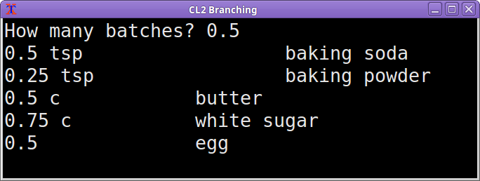
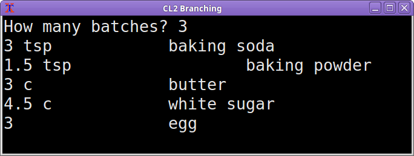

# CS 200 Lab 2: Recipe (Variables, Input, and Output)

## Introduction

Follow along step-by-step to work on this program. 

## Review

* Variables, Data Types
* Output (cout)
* Input (cin)

---

## Setting up your project

### Visual Studio

1. Create a new project. *File > New > Project...*
    1. Select **Visual C++** from the left category list.
    2. Select **Empty Project** from the template list.
    3. Set the project **Name** to "CL2 Branching".
    4. Set the project **Location**.
    5. Click **OK**.
2. Create your source file. In the **Solution Explorer**, right-click your project file. *Add > New Item...*
    1. Select **C++ File (.cpp)** and name it **CL2.cpp**.
    2. Click **Add**.

### Code::Blocks

1. Create a new project. *File > New > Project...*
2. Select **Empty project** and click **Go**.
    1. Enter a **Project title** (e.x., "CL2 Branching"),
    2. Choose a **Folder to create project in**.
    3. Click **Next >**
    4. Leave defaults checked for **Compiler**, **Create "Debug" configuration**, and **Create "Release" configuration**.
    5. Click **Finish**
3. Create your source file. **File > New > Empty File*
    1. It will ask if you want to save it. Select **Yes**.
    2. Save it in your project directory as **CL2.cpp**.
    3. Click **Save**
    4. Leave the default **Debug** and **Release** checked and click **OK**.

## Starter code

Paste the following into your .cpp file to start with:

    #include <iostream>
    #include <string>
    using namespace std;

    int main()
    {
        return 0;
    }
    
---

# Assignments

## Cookies

Here are the ingredients for sugar cookies:

* 1 tsp baking soda
* 1/2 tsp baking powder
* 1 c butter
* 1 1/2 c white sugar
* 1 egg

## Step 1: Output the recipe

Using the **cout** command, output the ingredient list above.

Test the program.

### Sample output:

### Solution

        #include <iostream>
        #include <string>
        using namespace std;

        int main()
        {
            cout << "1 tsp baking soda" << endl;
            cout << "1/2 tsp baking powder" << endl;
            cout << "1 c butter" << endl;
            cout << "1 1/2 c white sugar" << endl;
            cout << "1 egg" << endl;

            while (true); // kludgey fix
            return 0;
        }

---

## Step 2: Store amounts in variables

1. Create variables for the following. These should be **floats** or **doubles**:

    1. teaspoons of baking soda
    2. teaspoons of baking powder
    3. cups of butter
    4. cups of white sugar
    5. amount of eggs

2. Store the default ingredient amounts in these variables.
(Use "0.5" instead of 1/2)

3. Replace the hard-coded ingredient amounts with the variables
so that they can be tweaked and the program will update the amounts.

4. Test the program to make sure it still works.

---

## Step 3: Allow ratios

1. Create a variable called **ratio**. It should be a float or a double.

2. Ask the user how many batches they want to make, then store their input into **ratio**.
( 0.5 = half, 2.0 = double, 1.0 = normal )

3. Update the ingredient display, this time adjusting each ingredient by the ratio.

### Sample output:

---

# Turn In

Make sure to zip your entire project folder and upload it in the dropbox on D2L.

Also upload the .cpp file(s) to your class repository. [See Lab 1 for instructions](https://github.com/Rachels-Courses/CS200-Concepts-of-Progamming-Algorithms/blob/master/Assignments/In-class%20Labs/Lab%2001%20-%20Intro%20to%20GitHub%20and%20CPP.md#upload-files)
