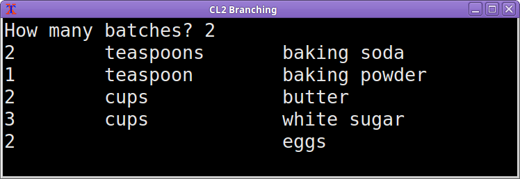

# CS 200 Lab 2: Recipe

## Introduction

Follow along step-by-step to work on this program. 
Turn in the source files (.cpp, .hpp) once finished.

## Review

* Variables, Data Types
* If statements
* Output (cout)
* Input (cin)

---

## Setting up your project

### Visual Studio

1. Create a new project. *File > New > Project...*
    1. Select **Visual C++** from the left category list.
    2. Select **Empty Project** from the template list.
    3. Set the project **Name** to "CL2 Branching".
    4. Set the project **Location**.
    5. Click **OK**.
2. Create your source file. In the **Solution Explorer**, right-click your project file. *Add > New Item...*
    1. Select **C++ File (.cpp)** and name it **CL2.cpp**.
    2. Click **Add**.

### Code::Blocks

1. Create a new project. *File > New > Project...*
2. Select **Empty project** and click **Go**.
    1. Enter a **Project title** (e.x., "CL2 Branching"),
    2. Choose a **Folder to create project in**.
    3. Click **Next >**
    4. Leave defaults checked for **Compiler**, **Create "Debug" configuration**, and **Create "Release" configuration**.
    5. Click **Finish**
3. Create your source file. **File > New > Empty File*
    1. It will ask if you want to save it. Select **Yes**.
    2. Save it in your project directory as **CL2.cpp**.
    3. Click **Save**
    4. Leave the default **Debug** and **Release** checked and click **OK**.

## Starter code

Paste the following into your .cpp file to start with:

    #include <iostream>
    #include <string>
    using namespace std;

    int main()
    {
        return 0;
    }
    
---

## Cookies

Here are the ingredients for sugar cookies:

* 1 tsp baking soda
* 1/2 tsp baking powder
* 1 c butter
* 1 1/2 c white sugar
* 1 egg

## Step 1: Output the recipe

Using the **cout** command, output the ingredient list above.

Test the program.

### Sample output:

---

## Step 2: Store amounts in variables

1. Create variables for the following. These should be **floats** or **doubles**:

    1. teaspoons of baking soda
    2. teaspoons of baking powder
    3. cups of butter
    4. cups of white sugar
    5. amount of eggs

2. Store the default ingredient amounts in these variables.
(Use "0.5" instead of 1/2)

3. Replace the hard-coded ingredient amounts with the variables
so that they can be tweaked and the program will update the amounts.

4. Test the program to make sure it still works.

---

## Step 3: Allow ratios

1. Create a variable called **ratio**. It should be a float or a double.

2. Ask the user how many batches they want to make, then store their input into **ratio**.
( 0.5 = half, 2.0 = double, 1.0 = normal )

3. Update the ingredient display, this time adjusting each ingredient by the ratio.

### Sample output:

---

## Step 4: Correct English

Update the ingredient output so that:

1. If the amount of that ingredient is one unit, display "teaspoon", "cup", etc.
2. Otherwise, display "teaspoons", "cups", etc.

Remember to update "egg" vs. "eggs" as well,
and the amount should be checked after the ratio is applied!

### Sample output:

---

## Optional: Cleanup

If your code has a lot of redundancy / duplicate code, how might you go about cleaning it up?

For example: If you have completely different **cout** statements
in the if / else statements, how can you boil it down so there
is no repeated language?

* If you're comfortable with functions, you could write a function 
called "DisplayIngredient"
that has the input "amount", "measurement", and "ingredient",
and formats those and displays them.

* If you're comfortable with arrays, you could store each ingredient
amount in an array, and use a for loop to display each amount.

* If you're comfortable with classes, an array of classes
would be useful, since the class could contain the 
ingredient name and the measurement name.

