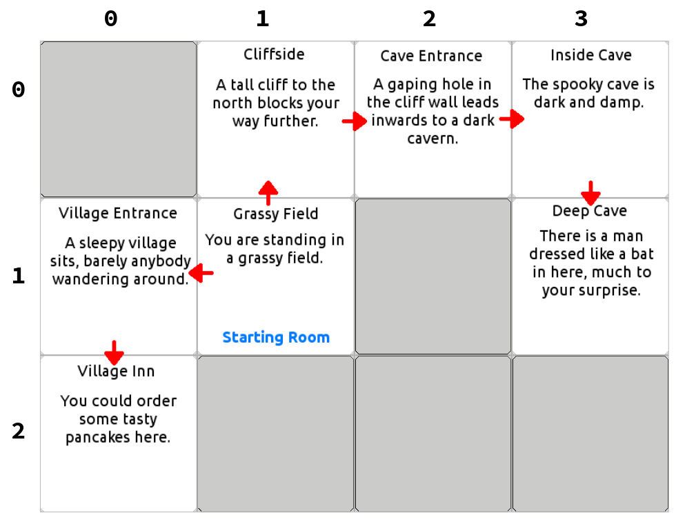
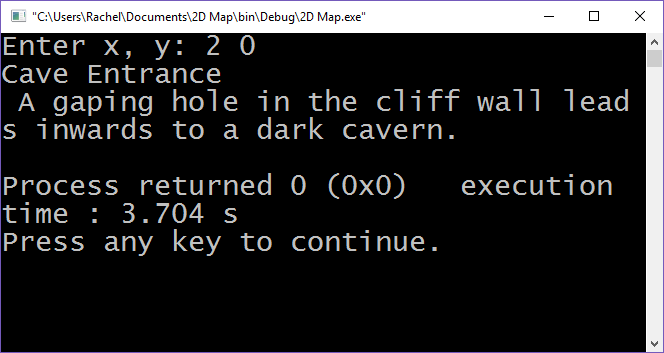
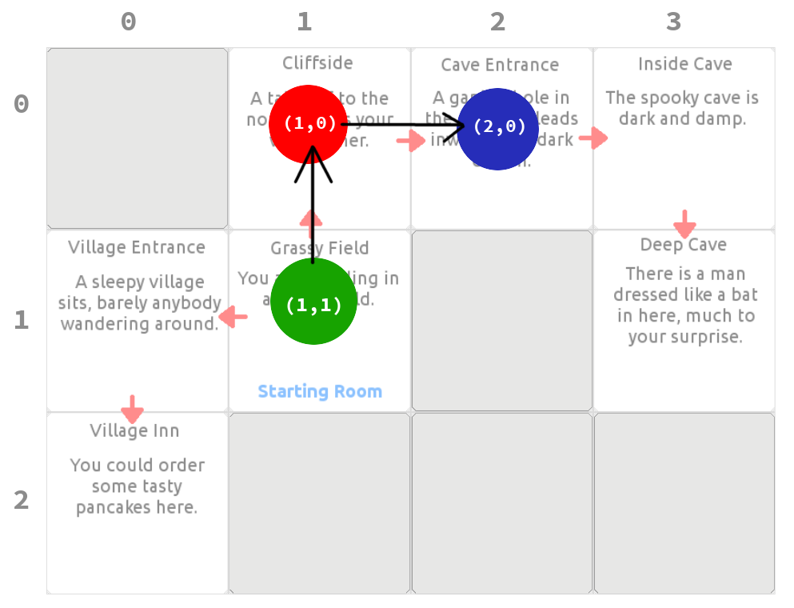
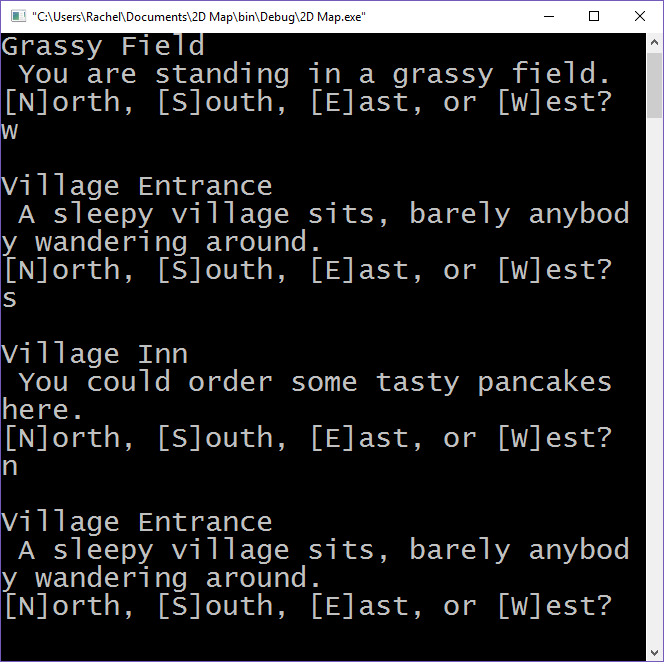
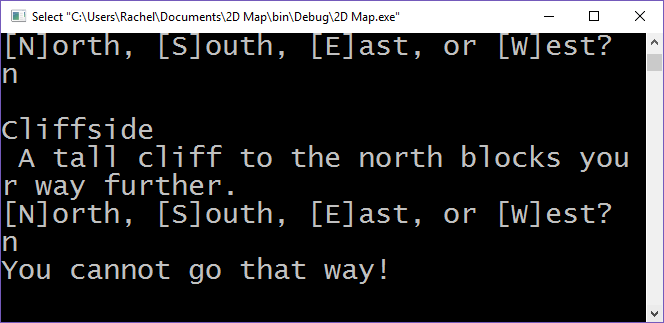
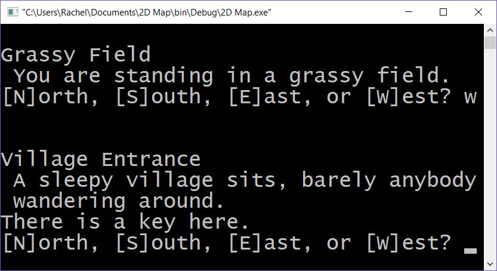
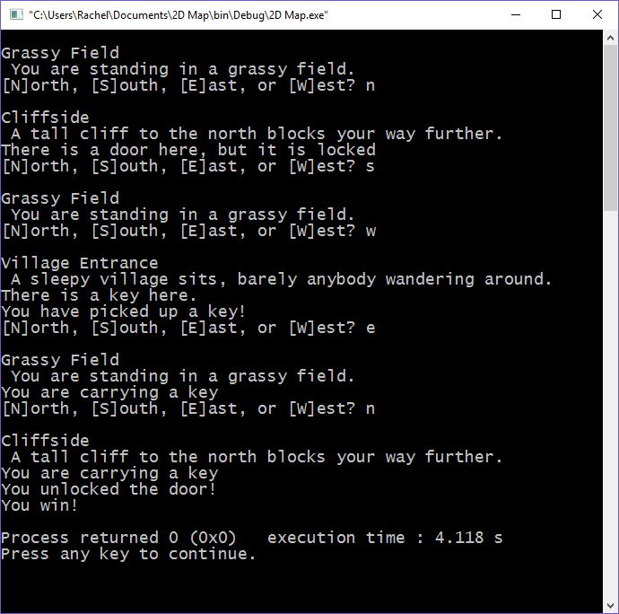

# CS 200 Lab 6: Text Adventure

Please read this document in Chrome. :)

## Topics

* For-Loops
* Arrays
* Strings
* Random Numbers

## Introduction

For this program, we will implement a small "Text Adventure", one feature at a time.
Many programs are not written from 0 to 100% in one pass - iterative development is key. Each feature needs to be developed, tested, and polished up before moving onto the next item.

The idea of the game is that you have a series of rooms that the player can move between. Each room has a name, and there might be items laying in each room to interact with.

We are boiling down the game elements to a really simple form to explore using arrays.

## Turn-in

Make sure to upload all your source files (.cpp) to the Dropbox.

When you're uploading your source to the Dropbox, make sure
to also leave a comment with the URL of your repository!

**Add the name of all people in your team in the upload comments**.

Turn in as one source file.

---

## Review: Random Numbers

In order to use random numbers in your C++ program, you need to include the cstdlib library:

	#include <cstdlib>

Random number generators require a *seed* to generate their "virtually" random values from. A good seed is to use the current time, so we would also need the ctime library:

	#include <ctime>

At the beginning of your main() function, seed the random number generator **once** by writing:

	srand( time( NULL ) );

(You only need to seed the generator one time!)

Then, you can generate a number between 0 and *n* (not-inclusive) with:

	int randomNumber = rand() % n;
---

# Feature 1: An array of rooms

We're going to create a grid of rooms that is 4 "rooms" wide and 3 "rooms" tall. It will look something like this: 

We are going to create a 2D array of **strings** to store this information:

	string rooms[4][3];

It would also be good to keep track of the map's width and height through separate variables as well:

	int mapWidth = 4;
	int mapHeight = 3;

Remember: arrays don't automatically keep track of how many elements they have, so we have to track the size manually.

Assign text to each room manually, to be similar to the map above. For the gray squares, you can fill out whatever text you'd like. You will assign text to each room like this:

	room[0][2] = "Village Inn \n You could order some tasty pancakes here.";

## Test 1 (Temporary code)

To test the functionality we've programmed so far, let's create some temporary code. This code will be removed after we're done testing this feature.

1. Ask the user to enter an X and a Y index.
2. Store the user's X and Y choices in two integer variables.
3. Display the value of the room at the X and Y position inputted in.

	
<h3 style="color:#aa0000">
		View Solution
	</h3>

    int x = 0;
    int y = 0;

    cout << "Enter x, y: ";
    cin >> x >> y;

    cout << rooms[x][y] << endl;

---

# Feature 2: Player position

Here you will create two integer variables to store the current location of the player. These integers just symbolize indices of the array. You might name these variables "playerX" and "playerY", or just "x" and "y".

Initialize the starting (X,Y) coordinate of the player to the starting position listed on the map above: (1, 1).

Afterward, we are going to create our game loop. While the game is running, the player will be able to move between maps by choosing N, S, E, or W.

1. Create a **isDone** variable and set it to **false**.
2. Create a while loop that will continue looping while **isDone** is false.
3. Within the loop...
	1. Display the room text at position x, y
	2. Display a menu to the user: *[N]orth, [S]outh, [E]ast, or [W]est?*
	3. Create a char variable named **choice**.
	4. Get the user's input and store it in **choice**.
	5. Convert **choice** to lower-case.
	6. Move the player in the appropriate direction. (Use an if statement and adjust the x, y coordinates).

## Lower-Case Char

Note: to change a char to a lower-case value, you can use the function **tolower**:

    cin >> choice;
    choice = tolower( choice );

That way, when you write your if statement to check the user's input, you don't have to check both "N" and "n".

## If Statement

After the user has entered their **choice**, you will want an if statement that will handle:

* choice is 'n'
* choice is 's'
* choice is 'e'
* choice is 'w'
* choice is something else - display an error, "Invalid choice!"

If the user's choice is 'n', the player needs to go north.

Do you see how you can move a character north based on their current position?

Assume that the player is at (1, 1), so x = 1 and y = 1.

* To move upwards, the y value needs to subtract: -1
* To move left, the x value needs to subtract: -1
* To move downward, the y value needs to add: +1
* To move right, the x value needs to add: +1 

Fill out the if statements to get this to work.

### Test!

Test the program to make sure the user can move around.

---

# Feature 3: Error checking!

However, if the user tries to move outside the bounds of the array, the program will crash! We need to make sure that the player cannot move outside the bounds of the map - in other words, the array.

The array is 4 elements wide and 3 elements tall, so:

* Array minimum x value: 0
* Array minimum y value: 0
* Array maximum x value: 3
* Array maximum y value: 2

We need to make sure that, before we add or subtract values from x,y that the values would be valid!

Adjust all 4 if statements so that they check:

1. If choice is 'n', and if y is greater than 0.
2. If choice is 's', and if y is less than *mapHeight - 1*
3. If choice is 'w', and if x is greater than 0.
4. If choice is 'e', and if x is less than *mapWidth - 1*

That way, the x, y adjustment would only happen if a valid number would result. If it wouldn't be valid, then the *else* statement is executed.

### Test!

Make sure that the program doesn't let the user leave the map!

---

# Feature 4: Map items

Now let's create a key and a door for the game world. Similarly to how we store the player's coordinates, we just need a couple of variables for each item to store the key's (x,y) coordinates and the door's (x,y) coordinates.

* Create integers: **keyX**, **keyY**, **doorX**, and **doorY**.
* Assign both X values to a random number between *0 and mapWidth*.
* Assign both Y values to a random number between *0 and mapHeight*.

Once we have coordinates for both of these items, let's show them in the map if you
are on the correct tile.

After displaying the current room:

	cout << rooms[x][y] << endl;

1. Do a check to see if the player's (x,y) is the same as the door's (x,y). If so, display a message: "There is a door here, but it is locked."
2. Do a check to see if the player's (x,y) is the same as the key's (x,y). If so, display a message: "There is a key here."

### Test!

Test out the program to make sure they appear on the map.

---

# Feature 5: Pick up the key

If the player's (x,y) matches the key's (x,y), let's go ahead and pick up the key automatically for the player. 

How do we know if the player has picked up a key?

A boolean might be the simplest!

### Create a boolean called "hasKey"
At the beginning of the program, create a **boolean** named **hasKey**, and initialize it to false.

### Pick up the key
For the case where the player's (x,y) is the same as the key's (x,y), display a message "You picked up the key!" and then set **hasKey** to true.

### Show key in inventory
Below the room information output, if the player has the key, also display "You are carrying a key."

### Deal with the door
For the case where the player's (x,y) is the same as the door's (x,y), modify it so that it also checks whether or not the player has the key.

* If the player *does not* have the key, display the same message as before: "There is a door here, but it is locked."
* If the player *does* have the key, display the message: "You have unlocked the door!" - then set isDone to true, or you might just **break** out of the while loop.

After the player has collected the key and gone to the door, the game will end, so at the end of the program before *return 0;*, display "You win!"

---

# Extra feature ideas

* Create a **monster** x,y coordinate, and if you land on the monster's room, you have to fight it.
* Don't make opening the door end the game - make it so that you can't pass through that room to the next room until you have the key.
* Draw a map with symbols and letters to let the player know where they are on the map.

