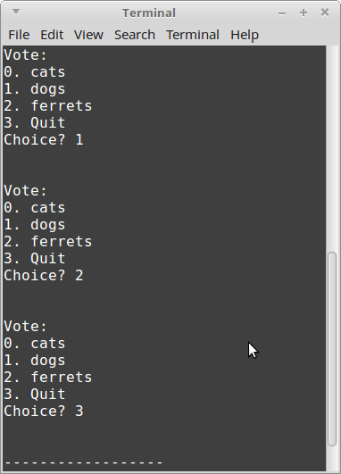
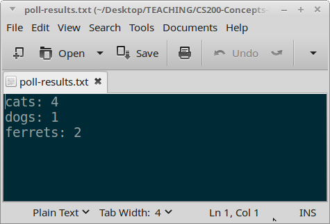

# CS 200 Lab 7: File I/O and Functions

Please read this document in Chrome. :)

## Topics

* File input
* File output
* Functions

## Introduction

Functions

## Turn-in

Make sure to upload all your source files (.cpp) to the Dropbox.

When you're uploading your source to the Dropbox, make sure
to also leave a comment with the URL of your repository!

**Add the name of all people in your team in the upload comments**.

Turn in as one source file.

---

# Review

## String Searching

[string::find](http://www.cplusplus.com/reference/string/string/find/)

Remember that strings in C++ have a **find** function.

* Call from: The string you're searching
* Input: Substring to find
* Output: Either:
	* If found: The position of the substring, between 0 and the size of the string, OR
	* If not found: string::npos, which is equivalent to -1.

So if you're searching a string, it would look like this:

	string haystack = "We can dance if we want to";
	string search = "dance";
	
	if ( haystack.find( search ) != string::npos )
	{
		cout << "FOUND" << endl;
	}
	else
	{
		cout << "NOT FOUND" << endl;
	}

## getline and ignore

Remember that if you try to get input from the user like this:

	string input;
	cin >> input;
	
it will automatically break at any whitespace - spaces, tabs, new lines, etc.

If you wanted to get someone to enter a string with spaces, you would need to use
the getline function instead of the input stream operator >>.

	string name;
	getline( cin, name );

When dealing with File I/O, you can also use the variable name of your
file in place of **cin** and use this same function.

## Output file

An output file requires an **ofstream** object:

	ofstream outFile;
	outFile.open( "filename.txt" );
	
	outFile << "Hi!" << endl;
	
	outFile.close();

## Input file

An input file requires an **ifstream** object:

	ifstream inFile;
	inFile.open( "filename.txt" );
	
	string text;
	infile >> text;
	
	inFile.close();

---

# Program 1: Save a poll's results

For this program, display a poll, allow multiple people to vote, and
then save the results out in a text file.

Create two arrays:

* **votes**: an array of integers of size 3. Initialize all elements to 0.
* **options**: an array of things the user can vote for. Initialize with 3 options.

These two arrays are related - one is the labels for what you can vote for,
and the other is the count of votes each option has received.
In the future, we can group these together in one data-type, but for now,
we're just keeping track of two separate arrays for this data.

Create a while loop that will keep running until the user decides to quit.
If the user doesn't quit, it allows them to vote for one of the 3 options.

*Hint: You can use a for-loop to display the indices of each element, and each option.*

When the user selects a vote, increment that vote's count in the **votes** array.

If the user exits, you will leave your program loop. It will then
open a file through **ofstream** and write out the results (both the options and each option's votes).

Make sure to close the file once you're finished.

	
<strong>
		A solution
	</strong>

	#include <iostream>
	#include <fstream>
	#include <string>
	using namespace std;

	int main()
	{
		int votes[3] = { 0, 0, 0 };
		string options[3] = { "cats", "dogs", "ferrets" };

		while ( true )
		{
			cout << endl << endl;
			cout << "Vote: " << endl;
			for ( int i = 0; i < 3; i++ )
			{
				cout << i << ". " << options[i] << endl;
			}
			cout << "3. Quit" << endl;

			cout << "Choice? ";
			int choice;
			cin >> choice;

			if ( choice == 3 )
			{
				break;
			}
			else
			{
				votes[ choice ]++;
			}
		}
		
		ofstream output( "poll-results.txt" );
		
		for ( int i = 0; i < 3; i++ )
		{
			output << options[i] << ": " << votes[i] << endl;
		}
		
		output.close();
		
		return 0;
	}

# Program 2: Read all contents from a file

In your project folder (the same directory as your source files),
create a new .txt file and add the contents:

	The Fox and the Grapes - An Aesop's Fable

	One hot summer's day a Fox was strolling through an orchard till he came to a bunch of Grapes just ripening on a vine which had been trained over a lofty branch.

	"Just the thing to quench my thirst," quoth he.

	Drawing back a few paces, he took a run and a jump, and just missed the bunch.

	Turning round again with a One, Two, Three, he jumped up, but with no greater success.

	Again and again he tried after the tempting morsel, but at last had to give it up, and walked away with his nose in the air, saying:

	"I am sure they are sour."

Name the file whatever you'd like - fable.txt, for example.

Then, in a program, you will write a program to read all the contents from the file,
and display the contents to the screen.

Create a function called **ReadFile**, whose return-type is **void** and
whose **parameter** is a string - the filename.

	void ReadFile( string filename )
	{
	}
	
Remember that functions can't go inside of other functions, so this function
should go above main.

The function will be called within main like this:

	int main()
	{
		ReadFile( "fable.txt" );
		
		return 0;
	}

Where you will pass in the text file - this way, you can keep
calling the function multiple times with different files, without
having to chance the core functionality.

In the **ReadFile** function, create a variable. Its data-type is
**ifstream**, and you can give it any name - I usually go with "input".

You can use the .open() function that belongs to ifstreams to open
a file. Pass in the filename from the function parameters:

	input.open( filename );
	
Next, you will want to create a buffer string to store data as it's 
being read in from the file. Create a string named **lineOfText**.

We can read in *one* line of text like this:

	getline( input, lineOfText );
	
but we want to keep looping for the entire file, until we have reached the end.
To do this, we can use a while loop, and use this **getline** function
as the while loop condition -- it will return *true* if reading a line was
successful, and *false* if it has reached the end of the file.

Within the while loop, simply output the lineOfText to the screen.

After the while loop, make sure to close the input file:

	input.close();

	
<strong>
		A solution
	</strong>

	#include <iostream>
	#include <fstream>
	#include <string>
	using namespace std;

	void ReadFile( string filename )
	{
		ifstream input;
		input.open( filename );
		
		string lineOfText;
		
		while ( getline( input, lineOfText ) )
		{
			cout << lineOfText << endl;
		}
		
		input.close();
	}

	int main()
	{
		ReadFile( "fable.txt" );
		
		return 0;
	}

# Program : Save and load a list of courses

# Program : Search a text document

# Program : Randomly generated poetry

