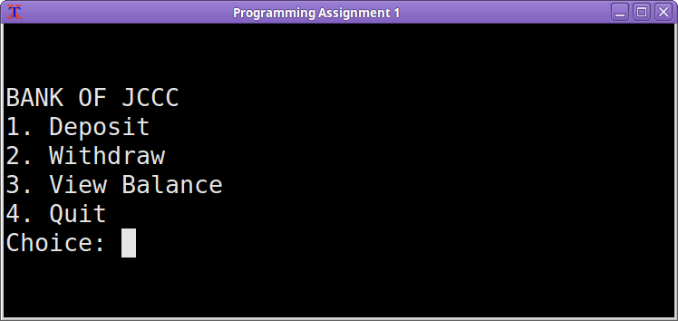
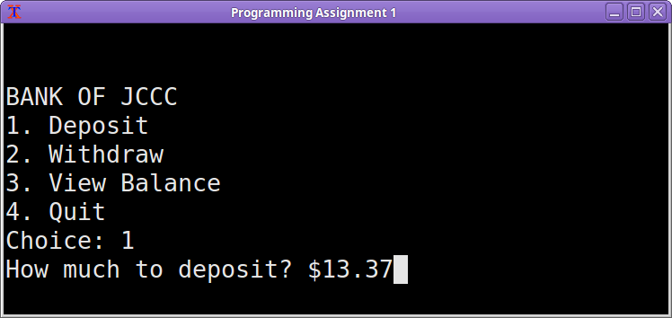
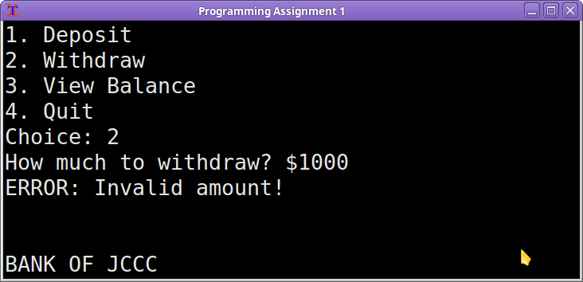
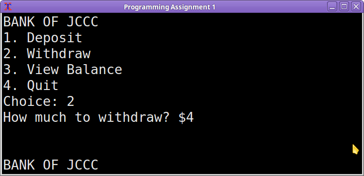
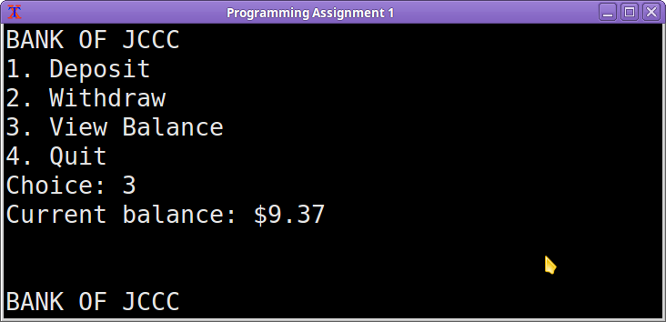

# CS 200 Programming Assignment 1

Bank Program

## Setup

Download the "PA1_Shell" folder. This contains some starter code,
as well as Code::Blocks and Visual Studio projects already set up.

### Files Included

* **main.cpp** - Invokes BankProgram
* **BankProgram.hpp** - Includes the BankProgram class and its method and variable declarations.
* **BankProgram.cpp** - Includes the method definitions for BankProgram.

## Turn-In

Once finished with your project, you will need to turn in all
**.cpp** and **.hpp** files into the Dropbox.

## Groupwork

You are allowed to collaborate with classmates on this assignment,
but no programming teams allowed for this first assignment,
since it is an introduction.

---

## Specification

For this assignment, you will complete the program by
filling in the function bodies in **BankProgram.cpp**.

Even though a class declaration is included for this assignment,
it has already been written for you and you do not need to worry
about class specifics.

All of your work will be done in BankProgram.cpp.

Also note that the BankProgram has a private member variable
called **m_balance**. This variable will be used throughout the functions.

### void BankProgram::Start()

In this method you will need to:

1. Initialize **m_balance** to 0.
2. Call the MainMenu function like this:

	MainMenu();

### void BankProgram::MainMenu()

This is where the program will continue running until the user decides to quit. There is already some code included, which is a
while loop that will continue running the program until the
**done** boolean flag is set to **true**.

Within the while loop:

1. Display the text:

	BANK OF JCCC
	1 Deposit
	2 Withdraw
	3 View Balance
	4 Quit
	
	Choice: 

2. Create a variable called **choice**, whose type is an integer.
3. Use the **cin** command to get the user's input and store it in the **choice** variable.
4. The program will then run specific functions based on the user's choice:
	1. If choice 1 is selected, call Deposit:

	Deposit();

	2. If choice 2 is selected, call Withdraw:
	
	Withdraw();

	3. If choice 3 is selected, call ViewBalance:

	ViewBalance();

	4. If choice 4 is selected, set the **done** boolean to **true**.

### void BankProgram::Deposit()

1. Display a message, asking the user how much they want to deposit.
2. Create a **float** variable named **amount**.
3. Get the user's input with **cin** and store it in **amount**.
4. Check to see if the amount is valid:
	1. If the amount is less than 0, it is invalid. Display an error message.
	2. Otherwise, add the **amount** to **m_balance**.

### void BankProgram::Withdraw()

1. Display a message, asking the user how much they want to withdraw.
2. Create a **float** variable named **amount**.
3. Get the user's input with **cin** and store it in **amount**.
4. Check to see if the amount is valid:
	1. If the amount is less than 0, it is invalid. Display an error.
	2. If the amount is greater than the value of m_balance, it is invalid. Display an error.
	3. Otherwise, subtract **amount** from **m_balance**.

### void BankProgram::ViewBalance()

Display the current value of **m_balance**.

---

## Sample Output

---

## Grading Rubric

<table>
	<tr>
		<th>Percentage</th>
		<th>Feature</th>
		<th>Description</th>
	</tr>
	
	<tr>
		<td> 5% </td>
		<td> Code compiles </td>
		<td> Code should build! How are you even testing if you can't build it? </td>
	</tr>
	
	<tr>
		<td> 5% </td>
		<td> Clean code </td>
		<td> Code is easy to read, consistently indented, descriptive variable names used. </td>
	</tr>
	
	<tr>
		<td> 10% </td>
		<td> Start() </td>
		<td> Initializing variable m_balance, calling MainMenu() function. </td>
	</tr>
	
	<tr>
		<td> 25% </td>
		<td> MainMenu() </td>
		<td> Menu is displayed cleanly, user input is obtained, program flow is branched based on user input. </td>
	</tr>
	
	<tr>
		<td> 25% </td>
		<td> Deposit() </td>
		<td> Clear prompt for dollar amount, getting user input for amount, error checking for valid amount, adjusting m_balance properly. </td>
	</tr>
	
	<tr>
		<td> 25% </td>
		<td> Withdraw() </td>
		<td> Clear prompt for dollar amount, getting user input for amount, error checking for valid amount, adjusting m_balance properly. </td>
	</tr>
	
	<tr>
		<td> 5% </td>
		<td> ViewBalance() </td>
		<td> Display the value of m_balance with label. </td>
	</tr>
</table>
